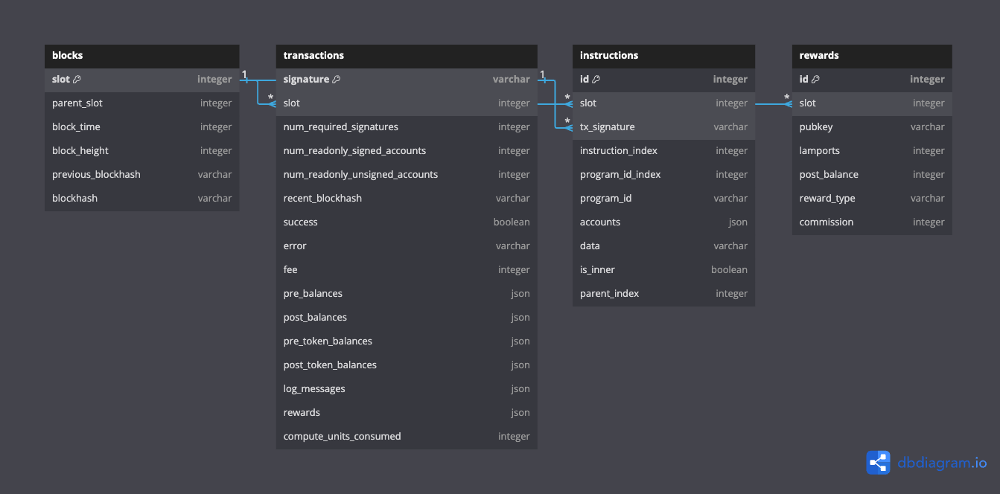

## Development

### Setting Up the Development Environment

To install dependencies, run:

```bash
poetry install
```

This will install all the dependencies defined in your `pyproject.toml` file.

### Activating the Virtual Environment

To activate the project's virtual environment, run:

```bash
poetry shell
```

This will spawn a shell with the virtual environment activated, allowing you to run 
Python scripts and commands within the virtual environment context.

### Running Tests

To run the test suite with pytest, use:

```bash
poetry run pytest
```

This will execute all tests found in the `tests/` directory.

### Formatting Code

To format your code automatically with Black, run:

```bash
poetry run black .
```

Black will reformat your files in place to adhere to its style guide.

### Linting Code

To lint your code with Ruff, run:

```bash
poetry run ruff .
```

Ruff will analyze your code for potential errors and style issues.


# To Do:

- Some slots/blocks are missing block time data. Want to partition on this field, so 
need to fill in the missing data.

- Fix partitioning in iceberg

- Data saving
    - v1: batch save data to parquet
    - v2: add iceberg/parquet as data sink
    - v3: implement streaming/micro-batch saving to iceberg

- Are there any guarantees on using saved data integrity on restarts?

- Parallel processing for historical backfills

- Handle chain reorgs
    - TBD if I want to handle this

- Data validation / quality checks